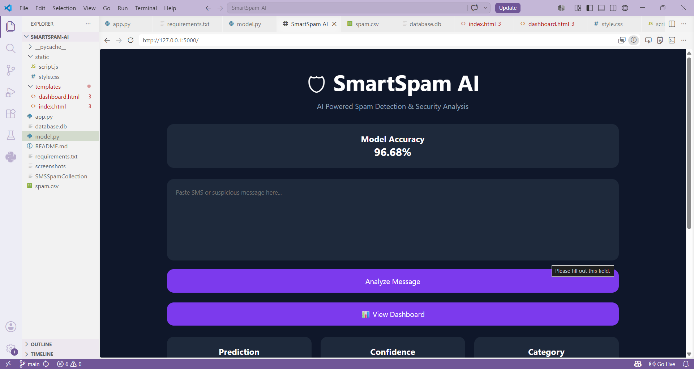
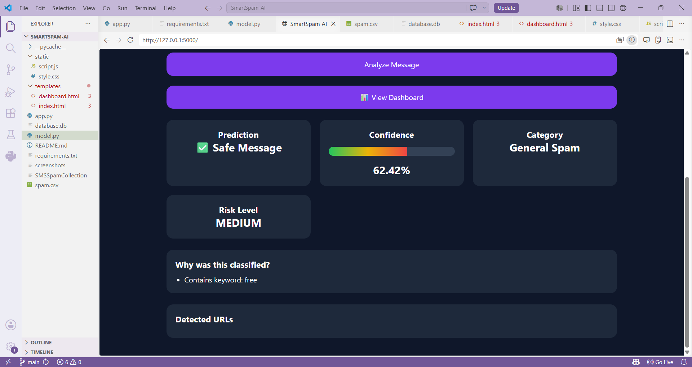

# 🛡 SmartSpam AI

AI Powered Spam Detection System built using Flask and Machine Learning.

## Features

- Spam Message Detection
- Confidence Score Meter
- Spam Category Classification
- Security Risk Analysis
- Dashboard Analytics
- Modern Dark Theme UI

## Tech Stack

- Python
- Flask
- Pandas
- Scikit-Learn
- HTML
- CSS
- JavaScript

## Machine Learning

- TF-IDF Vectorizer
- Multinomial Naive Bayes

## Accuracy

96.68%
## Screenshots

### Home Page


### Spam Detection

## Run Locally

```bash

pip install -r requirements.txt
python app.py